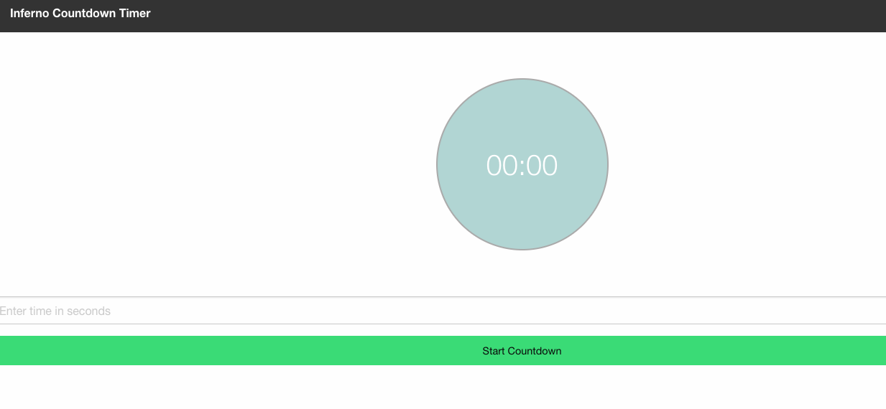

[**Table of Contents**](index.md)

# Create **Frontend** Unit Tests

The following tutorial is provided to help a contributor understand what type of frontend unit tests are used by IML. The code example below uses the same directory structure and nodejs libraries that are used throughout the IML Frontend code. 

The goal is to provide a small, stand alone set of code that functions correctly but requires the addition of unit tests. Unit tests are required to accompany every code feature that is delivered with IML.

## Credit to the developer of this tutorial
The original source code used in this tutorial was cloned from this source: 

[https://github.com/echessa/react-testing-with-jest](https://github.com/echessa/react-testing-with-jest)

The original tutorial may be found here: 

[https://auth0.com/blog/testing-react-applications-with-jest/](https://auth0.com/blog/testing-react-applications-with-jest/)

The source and test code was modified to fit the methods that are currently being used in the development of the Intel Manager for Lustre. Many thanks go out to the originator of this repository.

## Tutorial Description
This tutorial will provide source code that will make a Count Down Timer. 

See the the screenshot below:

### The steps of this tutorial are as follows:
* Clone the code
* Install the code dependencies
* Build the Code
* Pass the pre-commit tests
* Run the code
* Add Basic Unit Test code
* Run the Basic Unit Test code
* Add Advanced Unit Test code
* Run the Advanced Unit Test code

## Start of the Tutorial

### Clone the following:
* **git clone ADD-PATH-HERE/CountdownTimer.git**
* **cd CountdownTimer**

### Install Dependencies
* **yarn install**

### Build the code
* **yarn build**
